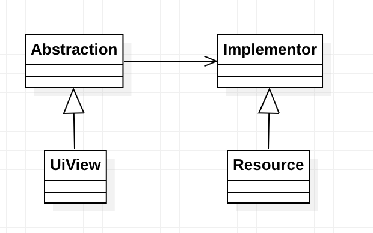

### Bridge

Esimerkkinä mediaresurssien käyttäminen käyttöliittymässä eri tavoin.

Silta rakennetaan resurssin, esim kirjan, elokuvan, musiikkilevyn (implementor) ja näkymän osan, esim. listaelementin, tai informaatiosivun välille.

Listaelementtiä kiinnostaa vaikka resurssin kuva ja nimi, ja informaatiosivua näiden lisäksi vaikka resurssin kuvaus ja tekijä.

Resurssi on implementor ja näkymä abstraction.

(shoutout [Christopher Okhravi](https://www.youtube.com/watch?v=F1YQ7YRjttI&ab_channel=ChristopherOkhravi))
