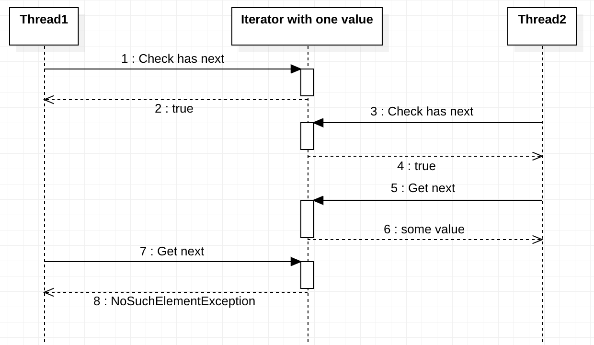

### a) Tutki ja raportoi, kuinka Javan iteraattori käyttäytyy, jos yritetään iteroida kokoelmaa kahdella säikeellä yhtä aikaa, kun molemmilla on oma iterattori

Eipä siinä mitään kummallista tapahdu. Molemmat iteroivat itsenäisesti iteroitavan läpi.

Kaikki on hyvin kunhan iteroitavan rakenteeseen ei kajota.

### b) entä, jos säikeet käyttävät samaa iteraattoria vuorotellen?

Käy hassusti jos ei synkronoi

### c) Kuinka käy, jos kokoelmaan tehdään muutoksia iteroinnin läpikäynnin aikana.

ArrayListin iteraattori palauttaa .next() kutsulla sen arvon mikä alkuperäisen iteroitavan elementti sillä hetkellä on. Eli iteroitavalle ei tehdä mitään deep copyjä tms ennen iterointia.

### d) Keksi jotain muuta testattavaa (esim. iteraattorin remove, forEachRemaining).

.remove() on ns ainoa turvallinen tapa muuttaa kokoelman muotoa iteroinnin aikana ellei ylikirjoittavat luokat ole määritelleet ns "concurrent modification policyä"

forEachRemaining on kiva. Deklaratiivisempi tapa toteuttaa sama asia ilman while looppia.

forEachRemaining ei tue edes .remove() metodia kokoelman rakenteen muuttamiseen iteroinnin aikana
